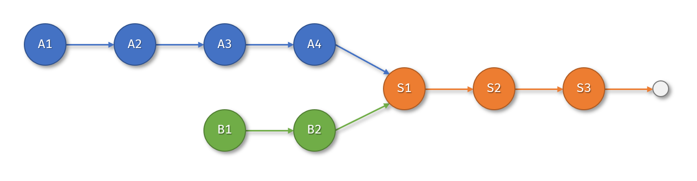

# 共享结点（题目编号：177）

## 一、已知条件

有单链表表示的线性表结构定义如下：

```c
//定义节点类型
typedef struct _node {
    int data;           //数据域
    struct _node *next; //指针域
} node;

//定义单链表类型
typedef struct {
    node *head;      //头指针
    unsigned len;    //链表中的节点数量
} list;
```

现已知有两个上述类型的线性表 La 和 Lb，二者在某个结点处融合在一起。如图 q2.png 所示：

提示：该图只是一个示例，La 不一定总是比 Lb 长；两个链表都可能为空。

## 二、任务描述

请设计一个算法，计算两个链表共享结点的数量。

## 三、编码要求

1. 算法函数原型

`int list_shared(list *La, list *Lb);`  
功能：计算并返回线性表 La 和 Lb 的共享结点的数量  
参数：La 和 Lb 都是指向线性表的指针  
返回值：La 和 Lb 共享结点的数目

2. 编码约束

时间复杂度：`O(max(La->len, Lb->len))`  
空间复杂度：`O(1)`

## 四、参考解答

```c
int list_shared(list *La, list *Lb) {
  if (La->head == NULL || Lb->head == NULL) return 0;
  node *p = La->head, *q = Lb->head;
  int len_a = 0, len_b = 0;

  // 同时找到两个链表的尾节点，并计算它们的长度
  while (p->next != NULL) {
    p = p->next;
    len_a++;
  }
  while (q->next != NULL) {
    q = q->next;
    len_b++;
  }

  // 如果尾节点不同，则返回0
  if (p != q) return 0;

  // 使两链表指针对齐（后面结点数相同）
  p = La->head;
  q = Lb->head;
  if (len_a > len_b)
    for (int i = 0; i < len_a - len_b; i++) p = p->next;
  else
    for (int i = 0; i < len_b - len_a; i++) q = q->next;


  // 同时移动两个指针，直到它们相遇
  while (p != q) {
    p = p->next;
    q = q->next;
  }

  // 计算从相遇点到链表末尾的节点数量
  int count = 0;
  while (p != NULL) {
    p = p->next;
    count++;
  }

  return count;
}

```
