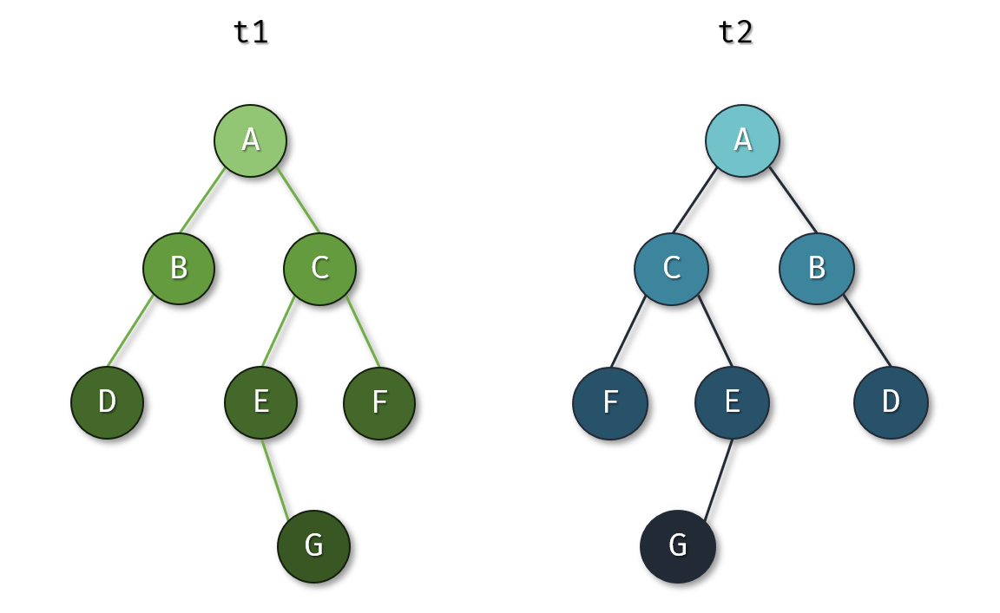

# 二叉树（题目编号：179）

## 一、已知条件

设有两棵二叉树t1和t2。如果t2是t1左右翻转得到，如图所示：

那么称二叉树t1和t2互为镜像。

二叉树的存储结构如下：
```c
typedef struct _btree_node {
char tag; //二叉树结点的字符标签
struct _btree_node *left, *right; //左子树和右子树
} btree_node, *btree;
```
## 二、任务描述

请设计一个算法，实现一棵二叉树的镜像翻转。

## 三、编码约束

1. 算法函数原型：

`btree mirror(btree tree);`  
功能：生成二叉树tree的镜像二叉树，返回镜像二叉树的根结点指针。  
参数：tree是指向源二叉树根结点的指针  
返回值：指向二叉树tree的镜像二叉树根结点的指针

2. 编码约束

时间复杂度：无特别要求  
空间复杂度：无特别要求

## 四、参考解答

```c
btree mirror(btree tree) {
  if (!tree) return NULL;
  btree t = (btree) malloc(sizeof(btree_node));
  t->tag = tree->tag;                 // 复制tag
  t->left = mirror(tree->right); // 交换左右子树
  t->right = mirror(tree->left);
  return t;
}
```