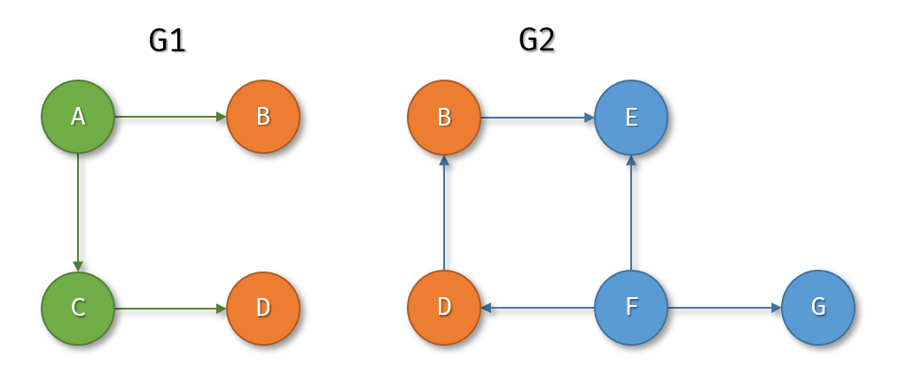
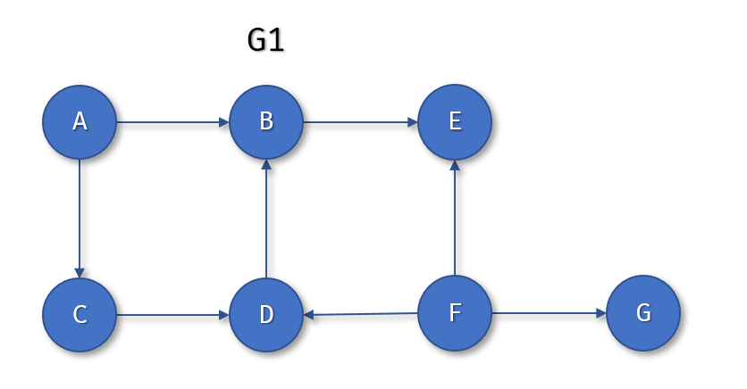
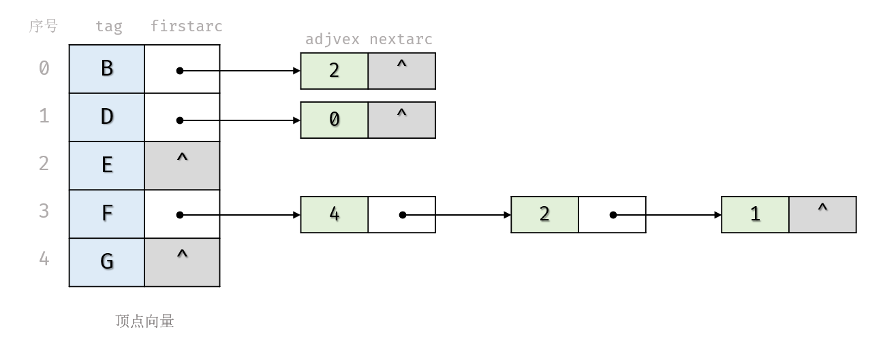

# 图的焊接（题目编号：181）

## 一、已知条件

设有两张 有向图 G1和G2，如图所示。

二者有一些 字符标签相同 的顶点（例中是B和D）。

现定义两张 图的焊接(weld) 是将二者的 标签相同的顶点合并，融合成一张图，其余顶点和边不变，如图所示。


有向图 用 邻接表 表示，结构如下：

```c
//定义最大顶点数量
#define
MAX_VERTEX_NUM 20

typedef struct _arc_node {
  int adjvex;          //该弧指向顶点在顶点向量中的序号
  struct _arc_node *nextarc; //指向下一条弧的指针
} arc_node;

typedef struct vertex_node {
  char tag;   //顶点字符标签
  arc_node *firstarc; //指向该顶点第一条弧的指针
} vertex_node;

typedef struct Graph {
  vertex_node vertex[MAX_VERTEX_NUM]; //顶点向量。下标从0开始。
  int vexnum, arcnum; //图的顶点数和弧数
} adjlist;
```

用上述数据结构描述的有向图G2的存储结构可以用图 q6-3.png 所示意：


另有根据结点字符标签 v 定位该结点在 图G 顶点向量中的 序号 的函数：

`int locate_vertex(adjlist* G, char v);`  
例如：`locate_vertex(G2, 'F')`返回的结果是3。

## 二、任务描述

焊接算法分为几个子算法，其中除了合并边（弧）的子算法，其余都已经完成。
现请设计一个算法，实现焊接算法的子算法：合并两张图的边（弧）。

## 三、编码要求

1. 算法函数原型：`void merge_arcs(adjlist *G1, adjlist *G2);  `   
   1. 功能：将图G2的边（弧）合并到G1中，即将G2中所有的边复制到G1中；G2保持不变。
   2. 如果两张图中只要有一张为空图（即顶点数为0），那么算法不做任何操作，即G1和G2保持不变。
   3. 参数：G1和G2都是指向图的指针。
   4. 返回值：无
   5. 注意：请用采用头插法处理链表的插入！

2. 编码约束
   1. 时间复杂度：无特别要求
   2. 空间复杂度：无特别要求

## 四、参考解答

> 编者以为该题想要完整的写出来过于复杂（是否越界，是否重复，是否存在等），不可能再考这种，故不提供代码