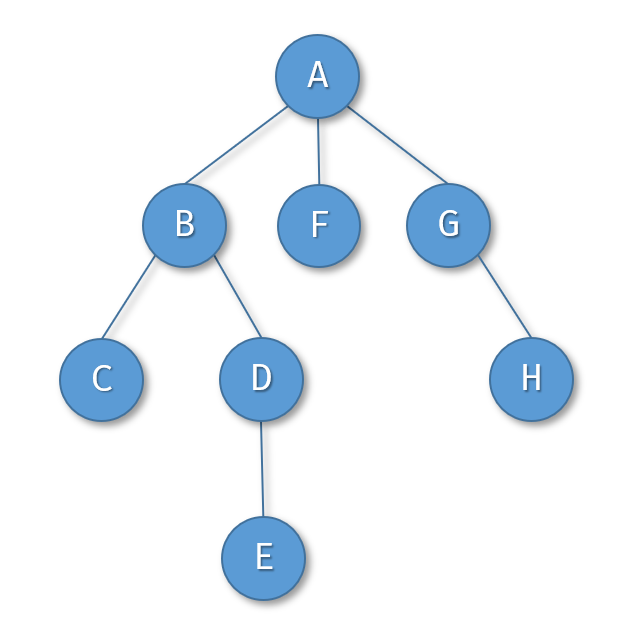
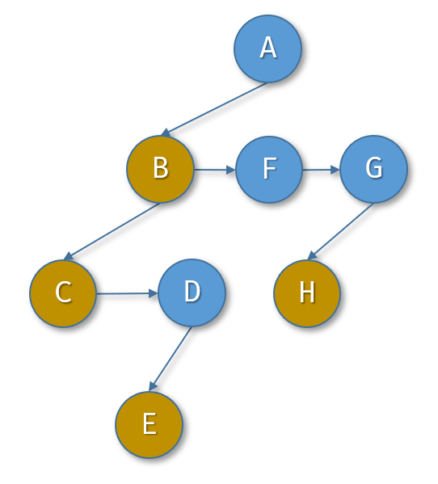

# 树的层序遍历（题目编号：180）

## 一、已知条件

设有如图的一棵树：

那么这棵树的 层次遍历 顺序就是：ABFGCDHE

如果这样的树的存储结构用如下 孩子-兄弟 表示法：

```c
typedef struct csnode {
char data;              //结点的字符标签
struct csnode *first;   //指向结点的第一个孩子结点
struct csnode *sibling; //指向结点的下一个兄弟结点
} csnode, *cstree;
```

利用以上存储结构的树可以形象地示意为下图：


其中，土黄色结点是其双亲结点的第一个孩子。

另有可用的 队列 操作的接口如下：

```c
bool queue_enter(queue *Q, void *v); //数据v进队Q。参数Q是指向队列的指针，v的类型是任意类型指针。
void* queue_leave(queue *Q); //数据出队。该数据是函数的返回值，其类型是任意类型指针。
bool queue_empty(queue *Q); //测试队列Q是否为空，如果为空返回真，否则返回假。
```

再有访问树结点的函数如下：  
`void visit(cstree node);`
其功能是输出结点node的字符标签。

## 二、任务描述

请设计一个算法，实现树的层次遍历。

## 三、编码要求

1.算法函数原型

`void layer(cstree root, queue *Q);`  
功能：对树tree进行层次遍历。遍历到某个结点node时，调用`visit(node)`来访问该结点。  
提示：如果是空树，则遍历没有输出。

参数：
root: 指向树根结点的指针  
Q: 指向已初始化的队列的指针  
返回值：无

2. 编码约束

时间复杂度：无特别要求  
空间复杂度：无特别要求

## 四、参考解答

```c
void layer(cstree root, queue *Q) {
  if (root) queue_enter(Q, (void *) root);
  csnode *node, *child;
  while (!queue_empty(Q)) {
    node = (csnode *) queue_leave(Q);
    visit(node);
    child = node->first; // 从孩子的角度开始遍历
    while (child) {
      queue_enter(Q, (void *) child);
      child = child->sibling;
    }
  }
}
```