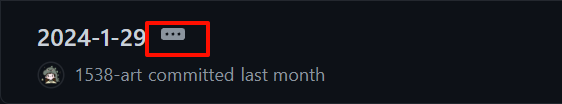
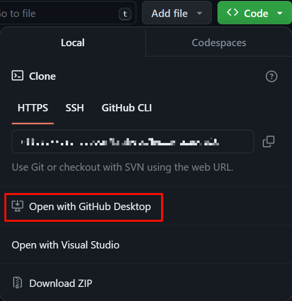
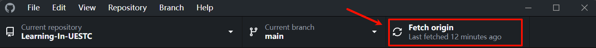
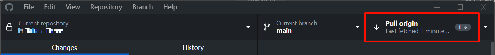

<h1 align="center" style="color:lightblue">Learning-In-UESTC</h1>

  
<u>目录</u>

	<ul>
    <li><a href="#00">00 前言</a></li>
    <li><a href="#01">01 声明</a></li>
    <li><a href="#02">02 使用方法</a></li>
    <li><a href="#03">03 Github的一些基础操作</a></li>
    <li><a href="#04">04 其他</a></li>
  </ul>

<h2 align="center" style="color:lightgreen" id="00">00 前言</h2>

欢迎来到本仓库！（来都来了，点个`Star`吧~）

来到一所大学，从第一次接触许多课，直到一门一门完成，这个过程中我们时常收集起许多资料和情报。

有些是需要在网上搜索的电子书，每次见到一门新课程，Google 一下教材名称，有的可以立即找到，有的却是要花费许多眼力；有些是历年试卷或者 A4 纸，前人精心收集制作，抱着能对他人有用的想法公开，却需要在各个群或者 CC98 中摸索以至于从学长手中代代相传；有些是上完一门课才恍然领悟的技巧，原来这门课重点如此，当初本可以更轻松地完成得更好……

我也曾很努力地收集各种课程资料，但到最后，某些重要信息的得到却往往依然是纯属偶然。这种状态时常令我感到后怕与不安。我也曾在课程结束后终于有了些许方法与总结，但这些想法无处诉说，最终只能把花费时间与精力才换来的经验耗散在了漫漫的遗忘之中。

我为这一年一年，这么多人孤军奋战的重复劳动感到不平。我希望能够将这些隐晦的、不确定的、口口相传的资料和经验，变为公开的、易于获取的和大家能够共同完善、积累的共享资料。

我希望只要是前人走过的弯路，后人就不必再走。这是我的信念，也是我建立这个项目的原因。

——(引自[浙江大学课程攻略共享计划](浙江大学课程攻略共享计划))

<h2 align="center" style="color:lightgreen" id="01">01 声明</h2>

本仓库仅包含软院内容，但一些内容应该各学院都适用。

本仓库内容仅作辅助学习用，且完全免费，禁止凭此盈利。

<h2 align="center" style="color:lightgreen" id="02">02 使用方法</h2>

- 本仓库主要采用以下结构便于查找：`学期`>`学科`>`细分`，如：
  - `1 大一 Freshman`
    - `03 微积分（上）`
      - `检测题`
      - `试卷`
- 本仓库中的任一文件夹下如有`README.MD`文件，请务必细看，可能有重要内容
- 如何查看本仓库的资料？
  - 直接在该页面点进对应资料预览（有些文件不支持预览或加载太慢以致效果不佳）
  - 查看下面 ↓ 的`7.`到`10.`
- 如何查看更新？
  - **[点我](https://github.com/1538-art/Learning-In-UESTC/commits/main/)** 然后点击如图按钮显示详情
  - 更具体的请查看下面 ↓ 的`11.`-`13.`

<h2 align="center" style="color:lightgreen" id="03">03 Github 的一些基础操作</h2>

（面向小白，需要自带魔法，想要了解更多，建议上手实操或看相关文章、视频）

1.`Code`：本仓库包含的内容  
2.`Issue`：遇到的问题，可在此处向作者提问  
3.`Pull request`：推送申请，若您也想向该仓库上传资料，可以在此处申请上传（可以简单理解为`Push request`）

4.`Watch`：选择通知方式，若有更新，会在您 Github 主页展示  
5.`Fork`：在你的账号下复制一份该项目  
6.`Star`：相当于收藏，点亮之后可以在个人主页的`Your stars`中看到该项目

7.`Code`：下载代码(文件)  
8.`Download ZIP`：将本仓库所有内容打包成`zip`文件下载  
9.`Open with GitHub Desktop`：通过`Github Desktop`将代码(文件)复制到本地（推荐，便于后续更新）

10.选择好下载路径，点击`Clone`即可

11.`Fetch origin`：检查仓库是否有更新，若有，会像下图显示

12.`Pull origin`：拉取更新，将更新内容同步到本地仓库

13.`History`：查看更新，如图

<h2 align="center" style="color:lightgreen"  id="04">04 其他</h2>

欢迎各位参与本仓库的建设，快来成为 contributor 吧！贡献方式：

- 提交 PR：先 Fork 本项目后在个人仓库中做出修改，发起 pull request 即可。
- Issue：添加附件在 Issue 中，由维护者添加。

另外，本仓库目前仅由我一人建设与维护，出错在所难免，还请见谅，也希望大家能够指出错误或提出建议。在此我也**诚邀热爱开源、有能力的同学和我一起管理！**

如有疑问（任何方面）可在 [**Issues**](https://github.com/1538-art/Learning-In-UESTC/issues) 中提出或通过 QQ 联系我：1538130391（当然，只是加个好友也欢迎哟）

一些资料来自网络或学长学姐，若您为其一作者，且并不希望其公开，可与我联系。
