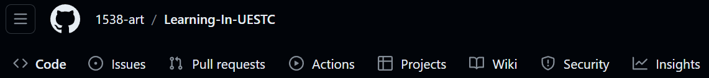
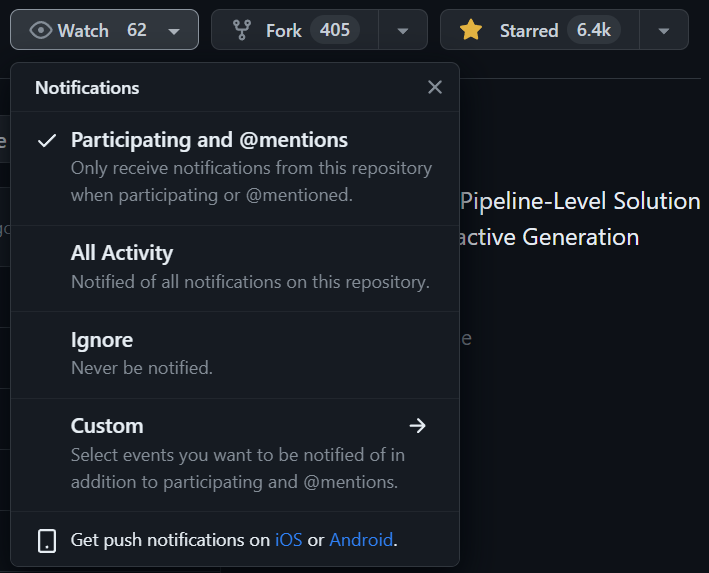

# Learning-In-UESTC

## 前言

欢迎来到本仓库！（来都来了，点个`Star`吧~）

无可否认，进入大学有一个非常重要的东西，那便是信息差，有时候你辛辛苦苦自己完成了一个任务，别人却早已用已有的材料先你一步。学习方面也是，花费过多时间在做无意义的作业或是寻找答案上无疑是非常不值当的，这也是我建立这个仓库的原因之一，我希望通过它来收集和分享学习资源，消除信息差，帮助同学们在学习中取得成功。

同时也希望各位能积极主动地加入本仓库的建设之中。一些对你已经没用的资料，或许正是别人苦苦寻找的；一些你已经完成的项目，或许就能拯救别人于水火之中。我相信每个人都有接受过别人的帮助，只要大家积极主动的帮助别人，这一优良传统就能得以延续。或许在未来的某天，学弟学妹们会由衷地发出感叹：“真是太感谢这位学长/学姐了！”

## 声明

本仓库仅包含软院内容，但一些内容应该各学院都适用。

本仓库内容仅作辅助学习用，且完全免费，禁止凭此盈利。

## 其他

欢迎各位参与本仓库的建设，快来成为contributor吧！

本仓库目前仅由我一人建设于维护，出错在所难免，还请见谅，也希望大家能够指出错误或提出建议

如有疑问（任何方面）可通过QQ联系我：1538130391

一些资料来自网络或学长学姐，若您为其一作者，且并不希望其公开，可与我联系。

## Github的一些基础操作

（面向小白，想要了解更多，建议上手实操或看相关文章、视频）

1. `Code`：本仓库包含的内容
1. `Issue`：遇到的问题，可在此处向作者提问
1. `Pull request`：推送申请，若您也想向该仓库上传资料，可以在此处申请上传（可以简单理解为`Push request`）

4. `Watch`：选择通知方式，若有更新，会在您Github主页展示
5. `Fork`：将仓库复制到本地，即下载仓库中的所有内容（会用github desktop的话推荐）
6. `Star`：相当于收藏，点亮之后可以在个人主页的`Your stars`中看到该项目